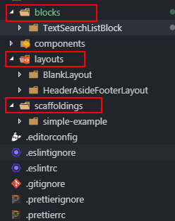
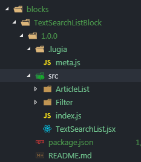

# 物料库规范

一套通用的描述物料的元数据的标准格式，规范约定了物料的类型、名称、版本、数据源、存储位置等信息。

## 元信息生成存储

从每个区块、布局、脚手架的目录下提取相应文件，自动生成文件

使用物料库开发者工具 `lugia-devtool` 生成

- 区块

`package.json`、`src/` ==> `.lugia/mega.js`

- 布局

`package.json`、`src/` ==> `.lugia/mega.js`

- 脚手架

`package.json`、`prompts.js` ==> `.lugia/mega.js`

- 物料库

这是一个 [lerna](https://github.com/lerna/lerna) 项目



```js
// lerna.json
...
"packages": [
  "blocks/*",
  "layouts/*",
  "scaffoldings/*"
],
...
```

\+ `package.json` ==> `.lugia/mega.js`

## 物料库元信息规范

```js
{
  // 元信息类型
  "metaType": "materials",

  // 名称
  "name": "react-materials",

  // 类型(react、vue、mobile、RN...）
  "type": "react",

  // 是否官方物料库
  "official": true,

  // 区块元数据
  "blocks": [BlockDesc],

  // 布局元数据
  "layouts": [LayoutDesc],

  // 脚手架元数据
  "scaffoldings": [scaffoldingDesc],

  // 公共下载配置
  "download": {
    "type": "npm",
    "registry": "http://192.168.102.79:5001/", // (可)
  }
}
```

## 区块元信息规范说明

```js
{
  // 元信息类型
  "metaType": "block",

  // (必)标识名 英文
  "name": "text-search-list-block",

  // (必)标题
  "title": "文本搜索列表",

  // （必）文件名
  "dirName": "TextSearchListBlock",

  // (可)区块详细说明
  "description": "",

  // (必) download 字段描述区块下载方式
  "download": {
    "type": "npm", // 或者 github、gitlab、local
    // npm
    "packageName": "text-search-list-block",
    "registry": "http://192.168.102.79:5001/", // (可)
    "version": "1.0.0",
    // npm end

    // github
    "repository": "owner/name",
    "clone": false,
    "branch": "master",
    // github end

    // gitlab
    "repository": "owner/name",
    "clone": false,
    "branch": "master",
    "customOrigin": "http://192.168.102.73:8081/",
    // gitlab end

    // local
    "path": "/f/materials/TextSearchListBlock",
    // local end

    "sourceCodeDirectory": "src"
  },

  // (必) 分类
  "categories": ["信息展示"],

  // (必) 截图
  "screenshot": "https://xxx.png",

  // (必) 发布时间
  "publishTime": "1535979136796",

  // (必) 最后修改时间
  "updateTime": "1535979136796",

  // (可) 额外依赖项
  "dependencies": {
    "uri": "1.0.1"
  },

  // (必) 外部使用的依据
  "useConfig": {
    "propTypes": {
      title: PropTypes.string,
      dataSource: PropTypes.array,
      onChange: PropTypes.func,
      Icon: PropTypes.element,
    },
    "defaultProps": {
      title: '',
      dataSource: [{}],
      onChange: noop = () => {},
      Icon: (
        <Icon
          type="warning"
          style={{
            color: '#FFA003',
          }}
        />
      ),
    },
  },

  // (必) 最佳宽度比例
  "proportion": 0.5,

  // (可) 保留字段, 依赖组件
  "components": {
    "@lugia/web/table": {}
  },

  // (可) 保留字段
  "extra": {
    // 分词, 用于搜索
    "participle": {
      /* ... */
    }
  }
}
```

## 布局规范说明

布局规范与区块类似

增加一个 `thumbnail` 用来指定抽象缩略图，用在新建页面流程中，用来选择布局，没有则使用默认的

删除 `proportion`

```js
{
  // (必) 抽象缩略图
  "thumbnail": "https://xxx.png"

  // 保留字段
  "mapFilesToUseConfig": {}
}
```

## 脚手架规范说明

```js
{
  // (必)标识名 英文
  "name": "@lugia/pro",

  // (必)标题
  "title": "门户脚手架",

  // (可)详细说明
  "description": "",

  // (可)脚手架预览地址
  "homepage": "https://xxx.html",

  // (必) source 字段描述下载方式，同上
  "source": {},

  // (可) 分类
  "categories": [],

  // (必) 截图
  "screenshot": "https://xxx.png",

  // (必) 发布时间
  "publishTime": "1535979136796",

  // （可） meta 文件地址
  "metaFile": "./meta.js",

  // (必) 最后修改时间
  "updateTime": "1535979136796",

  // (可) 保留字段
  "extra": {
    // 分词, 用于搜索
    "participle": {
      /* ... */
    }
  }
}
```

## 关于 发布/下载

### 发布

**单独发布**

为了使在 `desktop` 中创建的 `区块`、`布局` 可以公用，在 `desktop` 中可以单独发布 `区块`、`布局`。

默认发布在项目根目录下:

- `.lugia/local-materials/blocks`
- `.lugia/local-materials/layouts`

单独下载的 `区块`、`布局`会默认存储到项目根目录下，以便下次使用

**整体发布**

使用物料库开发者工具 `lugia-devtool` 自动发布

提供 `强制本地发布` 选项以便测试

### 下载

有四种下载方式

- local
- npm / 私有源
- github
- 私有 gitlab

### 缓存机制

除本地方式外，其实三种方式下载的文件都会存储在

`~user-home/.lugia/tmp/` 下

命名方式：`物料库名字` / `blocks/layouts/scaffoldings/` / `区块名字` / `版本`

例子：`C:\Users\hanbo\.lugia\tmp\official-materials\blocks\TextSearchListBlock\1.0.0`



#### 缓存使用

- 在无法连接网络时使用
- 在下载失败时，会查找是否有缓存文件可以使用
